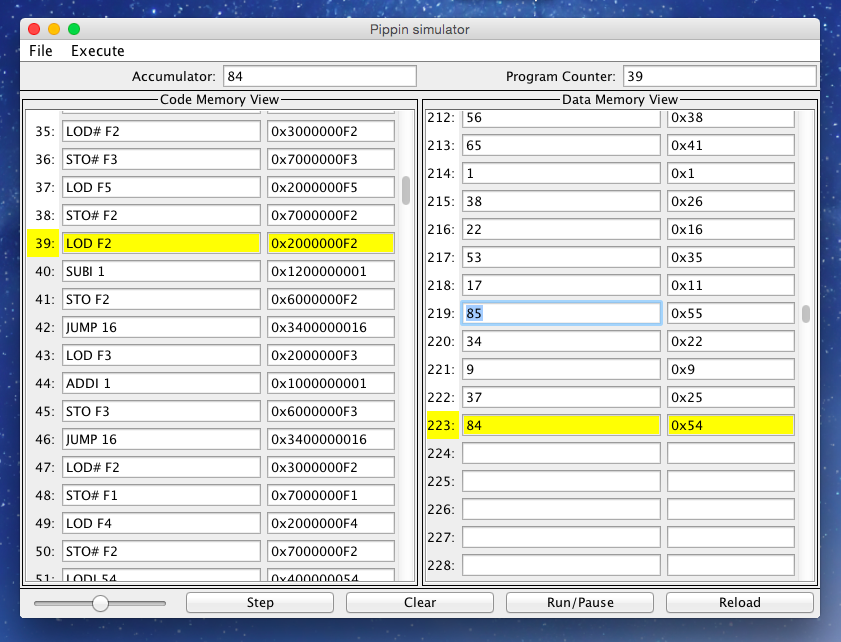

##Pippin-vm

Simulator for the Pippin machine language written in Java.

This was for Les Lander's CS 140 so some of it is from him.

Mostly by [Samuel David Bravo](https://github.com/samueldavidbravo) and [Daniel Romero](https://github.com/danielx0328).